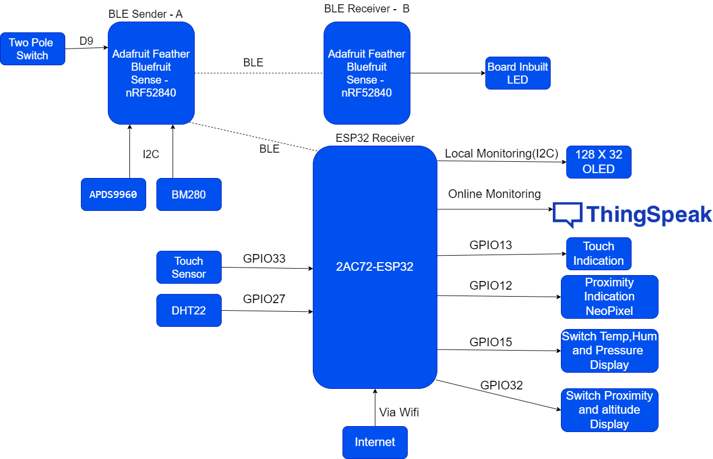
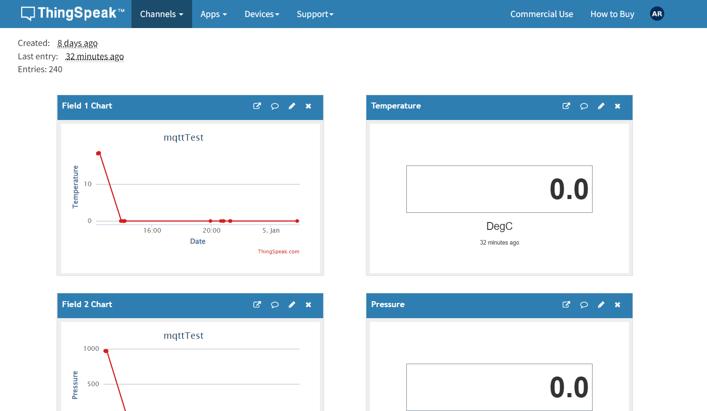

# Main project by integrating Esp32 and 2 nRF52840

- Here I used BLE protocol to exchange information between the above device. 

### Esp32 

- [ ] Receiver
- [ ] Receives Temperature, Altitutude, Pressure and Proximity from nRF52840 A

### nRF52840 - A

- [ ] Sender
- [ ] Send Temperature, Altitutude, Pressure and Proximity to Esp32
- [ ] Send input signal to nRF52840 B

##### Send format 

- [ ] Temperature   =  ("T" + string(Value)).encode("utf-8")
- [ ] Time.sleep(.5)
- [ ] Altitutude   =  ("A" + string(Value)).encode("utf-8")
- [ ] Time.sleep(.5)
- [ ] Pressure   =  ("P" + string(Value)).encode("utf-8")
- [ ] Time.sleep(.5)
- [ ] Proximity   =  ("R" + string(Value)).encode("utf-8")
- [ ] Time.sleep(.5)
- [ ] Input signal   =  ("I" + string(Value)).encode("utf-8")
- [ ] Time.sleep(.5)

### nRF52840 - B

- [ ] Reciever 
- [ ] Received input signal from nRF52840 A and turn on/off a LED lamp

## Architecture of the project 

## Implemented features

- [ ] Send Temperature, Altitutude, Pressure and Proximity to Esp32 from nRF52840 - A

- [ ] Send input signal from nRF52840 A to nRF52840 B. Based on this signal turn on or off a LED lamp 

- [ ] Connect OLED display to ESp32 via I2C

- [ ] Receive Temperature, Altitutude, Pressure and Proximity in Esp32 and display in OLED display 

- [ ] Connect WS2812B to esp32 controller via Neopixel driver and based on the proximity value switch the colors. 

##### Choosed proximity value and selected colors

- If proximity value is greater than 0 and less than 100  -  Color should be red 
- If proximity value is greater than 100 and less than 200  -  Color should be Green
- If proximity value is greater than 200 and less than 250  -  Color should be Blue

- [ ] Read the humidity values using DHT22 sensor and also displayed in the OLED module

- [ ] Configure a digital input as touch pad. When I touch to that input then a LED lamp should be triggered 

- [ ] Send the paramerted like Temperature, Altitutude, Humidity, Pressure, Touch Sensor output and Proximity values to Think Speak server for monitoring purpose.

- [ ] Developed a simple dashboard in Thing Speak platform for monitoring the parameter 

