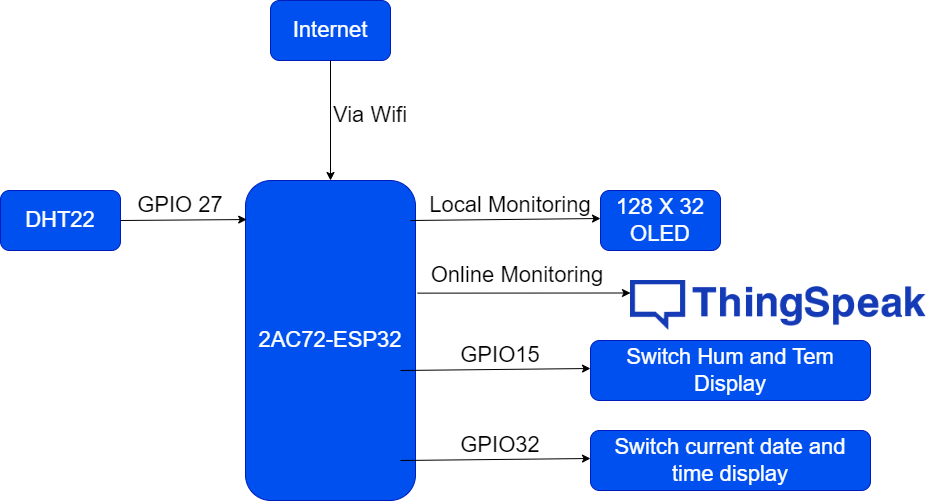

# ESP32 Mini project in Micropython 
 
 ### Procedure for fashing the controller before downloading the project

 - Download estool.py -  a Python-based, open source, platform independent utility to communicate with the ROM bootloader in Espressif SoCs.

 - Erase the controller using the command  - esptool.py --chip esp32 erase_flash.

 - Download the firmeware for Esp32 for Mircopython.

 - Then using the command and flash the controller -  esptool.py --port COM3 write_flash -z 0x1000 esp32-20220618-v1.19.1.bin

Then download the code to the controller using pymakr.

## Basic Architecture for the project

## Implemented feature 

- [ ] A DHT22 sensor module is connected to the controller to read temperature and humidity. It is connected to GPIO 27

- [ ] A controller is connected to internet via wifi 

- [ ] Ntp time is used to sync real-world time with controller time 

- [ ] A LED display is connected to the Esp32 controller to monitor various parameters

- [ ] Display the humidity and temperature in the OLED module (when pressing button A of OLED)

- [ ] Display the real-world data and time in the OLED module(When pressing button B of OLED)

- [ ] Upload the humidity and temperature value to Thing Speak Server for remote monitoring via http post request

- [ ] Developed a simple dashboard to monitor the humidity and temperature via internet in Thing Speak platform

