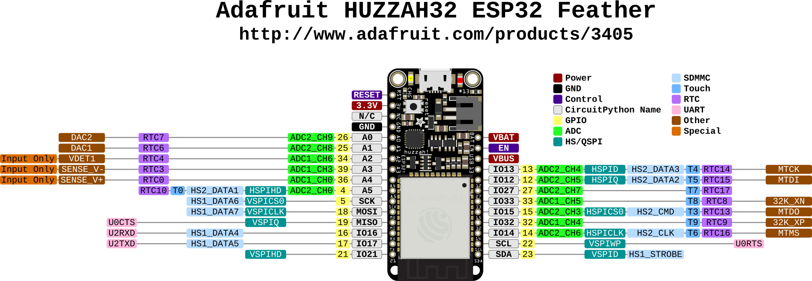
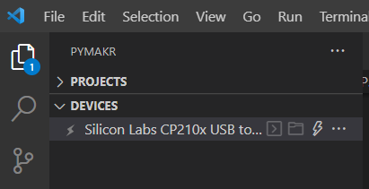
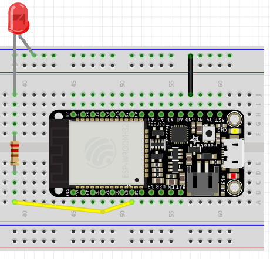
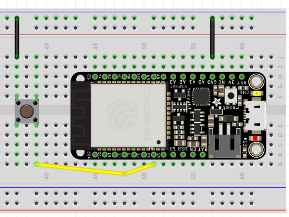
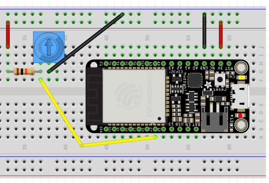
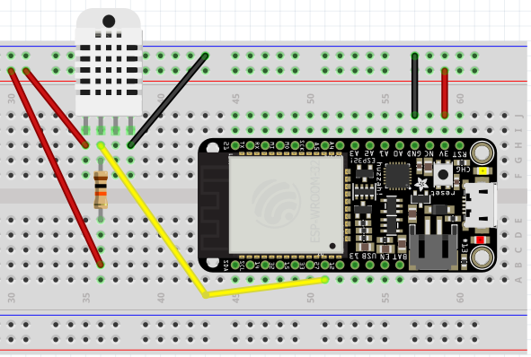
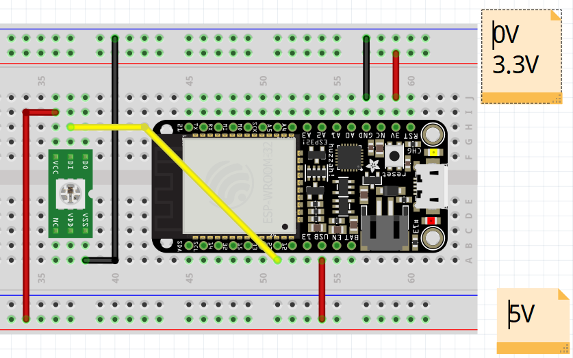

First steps with programming the ESP32
Maxime Lefrançois maxime.lefrancois@emse.fr v1.0, 2022-11-16
:homepage: http://ci.mines-stetienne.fr/cps2/course/pcd/
:toc: left

In this lab you will learn to flash and program your ESP32 microcontroller with micropython.

== Introduction to the Adafruit HUZZAH32 - ESP32 Feather

ESP32 is a series of low-cost, low-power system on a chip microcontrollers with integrated Wi-Fi and dual-mode Bluetooth link:https://en.wikipedia.org/wiki/ESP32[(Wiki)].

The main microcontroller we use is a link:docs/adafruit-huzzah32-esp32-feather.pdf[FeatherBoard Adafruit HUZZAH32], that contains the link:docs/espressif-esp-wroom-32.pdf[Espressif ESP32-WROOM-32 module], a generic Wi-Fi + Bluetooth + Bluetooth Low Energy microcontroller unit. At its core, the ESP32-WROOM-32 module uses the link:docs/espressif-esp32.pdf[ESP32-D0WDQ6 chip].

.The Adafruit HUZZAH32 - ESP32 Feather pinouts

Browse the specifications about the ESP32-D0WDQ6, the ESP32-WROOM-32, and the FeatherBoard Adafruit HUZZAH32, and **answer the following questions:**

1. **What kind and how much of flash memory do each SoC provide?**

  ESP32-D0WDQ6 -- No embedded flash, ESP32-WROOM-32 -- 4 MB of external SPI flash, Adafruit HUZZAH32 -- 4 MByte flash

2. **What is the difference between pin A0 and pin A2?**

  A0 -- Used for both Analog output and analog input (it has ADC and DAC)
  A2 -- Used for only Analog input and not as a analog output (It has only ADC)

3. **Which ADC pins can't be used once the WiFi is initialized? Why? (WARNING: there are contradictory statements in the FeatherBoard Adafruit HUZZAH32 document, so double check online)**
  
  Once wifi has started, we can only read analog inputs on ADC #1 and we can't use ADC #2 because it is used as a wifi driver.

4. **Which GPIO pins are input only?**

  From GPI #34, GPI #36 and  GPI #39.

5. **On which SoC is the WiFi antenna? the Bluetooth antenna?**

 The ESP32 from Espressif Systems is a 2.4 GHz Wi-Fi and Bluetooth SoC with integrated antenna switches. 
 ESP32 can interface with other systems to provide Wi-Fi and Bluetooth functionality through the SPI / SDIO or I2C / UART interfaces.

6. **What are GPIO6 to GPIO11 used for?**

  GPIO6 to GPIO11 are connected to the integrated SPI flash integrated on ESP32-WROOM-32 (ESP-WROOM-32) and are not recommended for other uses.

7. **On the FeatherBoard Adafruit HUZZAH32, there is a small chip with the inscription `SIL 2104 F0199 1705+`. What is that for?**
  
  It is a highly-integrated USB-to-UART Bridge Controller provides a complete plug and play interface solution.

8. **Which GPIO pins are recommended for digital output? Digital input?**

  IO12 to IO16, IO21, IO27,IO33, and IO32.

9. **Why is GPIO#13 special?**

  an analog input A12 on ADC #2. It's also connected to the red LED next to the USB port

10. **How can the ESP32 hall sensor be used? (to do what, with reading what on what pin)**

  ESP32 integrates a Hall sensor based on an N-carrier resistor. When the chip is in the magnetic field, 
  the Hall sensor develops a small voltage laterally on the resistor, which can be directly measured by the ADC.

11. **What UART is used for bootloading/debug?**

  The Protocol Used in UART Bootloader is based on Ymodem protocol. The Ymodem protocol sends data in 1024-byte blocks.

12. **What is a JST jack? What is it used for on the FeatherBoard Adafruit HUZZAH32?**

  JST connectors are the electrical connectors manufactured to the design standards. 
  BAT is the positive voltage to/from the JST jack for the optional Lipoly battery on the FeatherBoard Adafruit HUZZAH32. The JST connector polarity is matched to Adafruit LiPoly batteries.

13. **What is the USB voltage?**

    Most computer USB ports supply 5V

14. **What happens if we connect `GND` and `USB`? (DO NOT TRY)**

    The connections will destory and the smoke out.

15. **What is the Serial0 interface used for?**

    Serial 0/0 means that this is the first interface from a module, attached in slot 0 into the cassis of the router.

16. **What are 32 KHz crystals used for?**

    It is 'cheap as chips' and it is one kind of the clock crystal frequency for timing device, mainly used on the small communication devices.

17. **When the ADC is configured with `atten=3`, what integer would we read when measuring 1V?**

 atten = 3 then min voltage = 100 mv and max volt = 1300 mv 

 then integer value when measuring 1 v is 1000

== Flash MicroPython on the ESP32

link:https://micropython.org/[MicroPython] is a full Python compiler and runtime that is optimized to run on microcontrollers. One can use an interactive prompt (the REPL) to execute commands immediately, or upload a set of python files to the microcontroller.

In this lab we will flash the micropython firmware on the ESP32, then use the Pymakr extension for link:https://code.visualstudio.com/Download[Visual Studio Code].

Follow the MicroPython tutorial link:https://docs.micropython.org/en/latest/esp32/tutorial/intro.html#esp32-intro[Getting started with MicroPython on the ESP32], and keep in mind the notes below.

NOTE: the "port" setting is `COM*` on Windows, `/dev/ttyS*` on Linux, `/dev/cu.*` on macOS (where * means "something"). Follow link:https://docs.espressif.com/projects/esp-idf/en/latest/esp32/get-started/establish-serial-connection.html#check-port-on-windows[this guide for Windows] or link:https://docs.espressif.com/projects/esp-idf/en/latest/esp32/get-started/establish-serial-connection.html#check-port-on-linux-and-macos[this guide for Linux and macOS] to find what port the FeatherBoard Adafruit HUZZAH32 is using.

NOTE: Windows users. If you don't see the COM port for your device, it may mean that the CP2104 USB to UART Bridge controller pilots are not installed. You can install link:https://www.silabs.com/developers/usb-to-uart-bridge-vcp-drivers[download them] and install them manually from the Device Manager.

NOTE: Windows users, you may use the Windows Subsystem for Linux version 1 (WSL1) to run commands. If your "port" setting is `COM5` on windows, then it becomes `/dev/ttyS5` on WSL1. Make sure your distribution uses WSL1 (not WSL2). If not, you can either convert an existing WSL2 distribution to WSL1, or install a fresh WSL1 distribution. Find tutorials online. 

== Open the interactive prompt (the REPL)

Once the MicroPython firmware is flashed on the device, you can install the Pymakr extension for link:https://code.visualstudio.com/Download[Visual Studio Code].

1. Make sure you have link:https://code.visualstudio.com/Download[Visual Studio Code] installed 
2. Make sure you have the following extensions installed: link:https://marketplace.visualstudio.com/items?itemName=donjayamanne.python-extension-pack[Python Extension Pack], link:https://marketplace.visualstudio.com/items?itemName=ms-python.vscode-pylance[Pylance], link:https://marketplace.visualstudio.com/items?itemName=pycom.Pymakr[Pymakr].

In the Pymakr extension tab, you should find your device under `DEVICES`. Click on "Connect Device" (🗲 button), then on "Create a Terminal". 

That's it, you opened a REPL on the ESP32! Let's play a bit with it.

.Pymakr extension tab

== Turn on/off the LEDs

You need to check out the following guides for this exercise:

* link:https://docs.micropython.org/en/latest/esp8266/tutorial/repl.html#using-the-repl[Using the REPL]
* link:https://docs.micropython.org/en/latest/esp32/quickref.html#pins-and-gpio[MicroPython quick reference guide on Pins and GPIO].
* link:https://docs.micropython.org/en/latest/esp32/quickref.html#timers[MicroPython quick reference guide on Timers].

.Answer these questions and copy your code snippets below 

. Turn on and off the embedded LED on GPIO#13.
  [source,python]
----
  import machine
  pin = machine.Pin(13, machine.Pin.OUT)
  pin.on() //If LED is in off
  pin.off() //If LED is in on
----
. Connect the LED you have in your briefcase to GPIO#27 as on the image below. Turn on and off this LED.  
  [source,python]
----
  import machine
  pin = machine.Pin(27, machine.Pin.OUT)
  pin.on() //If LED is in off
  pin.off() //If LED is in on
----
.LED on GPIO#27

[start=3]
. Create a timer to turn on and off the LED on GPIO#13 every 500ms.
[source,python]
----
 import time
from machine import Pin
pin = Pin(13, Pin.OUT)
while True:
     pin.on()
     time.sleep(.5)
     pin.off()
     time.sleep(.5)
---- 
. Find a way to turn on and off the LED on GPIO#13 every 500ms, and the LED on GPIO#27 every 300ms.
[source,python]
----
import time
import _thread
from machine import Pin
pin = Pin(13, Pin.OUT)
pin1 = Pin(12, Pin.OUT)

def ledFunction(outputPort,delay):
     while True:
          outputPort.on()
          time.sleep(delay)
          outputPort.off()
          time.sleep(delay)
          
_thread.start_new_thread(ledFunction,(pin,.5))
_thread.start_new_thread(ledFunction,(pin1,.3))
----
. As the ESP32 has only four hardware timers (other microcontrollers usually have less), it wouldn't be possible to generalize the solution of exercise 4 to _n_ LEDs. Develop a solution that uses the link:https://docs.micropython.org/en/latest/library/uasyncio.html[`uasyncio` module for asynchronous I/O scheduling] 

[source,python]
----
import time
import uasyncio
from machine import Pin
pin = Pin(13, Pin.OUT)
pin1 = Pin(12, Pin.OUT)

async def turnOnLed(outputPort,delay):
  while True:     
      outputPort.on()
      await uasyncio.sleep_ms(delay)   
      outputPort.off()
      await uasyncio.sleep_ms(delay)

async def main1(pin1, pin2):
     uasyncio.create_task(turnOnLed(pin1, 500))
     uasyncio.create_task(turnOnLed(pin2, 300))
         
event_loop = uasyncio.get_event_loop()
uasyncio.create_task(turnOnLed(pin1, 300))
uasyncio.create_task(turnOnLed(pin, 500))
event_loop.run_forever()
----
NOTE: check how to link:https://docs.micropython.org/en/latest/esp8266/tutorial/repl.html#paste-mode[enter the special paste mode in the REPL] to copy and paste blocks of code 

== Switch the LED when the button is pressed

You need to check out the following guides for this exercise:

* link:https://docs.micropython.org/en/latest/library/machine.Pin.html?highlight=irq#class-pin-control-i-o-pins[class Pin – control I/O pins], and especially link:https://docs.micropython.org/en/latest/library/machine.Pin.html?highlight=irq#machine.Pin.irq[the `Pin.irq()` method]

.Button on GPIO#27. When the button is pressed, the voltage on GPIO#27 is low. 

.Answer these questions and copy your code snippets below 
. Configure GPIO#27 as input with internal pull-up (so the default value is HIGH), and turn on and off the embedded LED on GPIO#13 whenever the button is pressed (on falling edge).

[source,python]
----
from machine import Pin

input  = Pin(12, mode=Pin.IN, pull=Pin.PULL_DOWN)
ouput  = Pin(13, mode=Pin.OUT)

while True:
    if input.value() == 1:
        ouput.on()
    else:
        ouput.off()
----

In the first push turn on the led and the second push turn of the led
[source,python]
----
from machine import Pin

input  = Pin(12, mode=Pin.IN, pull=Pin.PULL_DOWN)
output  = Pin(13, mode=Pin.OUT)
flag = False
while True: 
  if (input.value() == 1 and flag == False):
     output.on()
     flag = True
  elif(input.value() == 1 and flag == True):
      output.off()
      flag = False
----

== Print the value of the potentiometer

You need to check out the following guides for this exercise:

* link:https://docs.micropython.org/en/latest/esp32/quickref.html?highlight=adc#pwm-pulse-width-modulation[PWM (pulse width modulation)]
* link:https://docs.micropython.org/en/latest/esp32/quickref.html?highlight=adc#adc-analog-to-digital-conversion[ADC (analog to digital conversion)]

The circuit below is a simple voltage divider with a resistor of 10 kΩ and a potentiometer of 10 kΩ. 

.Potentiometer on GPIO#27. 

.Answer these questions and copy your code snippets below 
. Demonstrate the voltage measured on GPIO#27 should range between 0V and 1750mV
This voltage can be controlled based on the selected attenuation.
[source,python]
----
ADC.ATTN_0DB: No attenuation (100mV - 950mV)
ADC.ATTN_2_5DB: 2.5dB attenuation (100mV - 1250mV)
ADC.ATTN_6DB: 6dB attenuation (150mV - 1750mV)
ADC.ATTN_11DB: 11dB attenuation (150mV - 2450mV)
----
. Write a timer that reads the raw analog value every every 100 ms, and print the actual voltage to the UART0
[source,python]
----
from machine import Pin, ADC, UART
from time import sleep

uart = UART(1, 115200)                        
uart.init(115200, bits=8, parity=None, stop=1) 

pot = ADC(Pin(34))
pot.atten(ADC.ATTN_6DB)

while True:
  value = pot.read()
  uart.write(value)
  print(value)
  sleep(0.1)
----
. Use this value to control the pulse width modulation duty cycle on GPIO#13, so as to control the luminosity of the inner LED
[source,python]
----

from machine import Pin, ADC
from time import sleep
import math 

pot = ADC(Pin(34))
p12 = machine.Pin(12)
pot.atten(ADC.ATTN_6DB)

led = machine.PWM(machine.Pin(13), freq=1000)
def pulse(l, t):
    for i in range(20):
        l.duty(int(math.sin(i / 10 * math.pi) * 500 + 500))
        time.sleep_ms(t)
while True:
  value = pot.read()
  print(value)
  sleep(0.1)
  pulse(led,50)
----
== Hello Internet !

You need to check out the following guides, examples, and sources, for this exercise:

* link:https://docs.micropython.org/en/latest/library/time.html[`time` – time related functions]
* link:https://docs.micropython.org/en/latest/esp32/quickref.html#networking[Networking]
* link:https://github.com/micropython/micropython-lib/blob/master/micropython/net/ntptime/ntptime.py[sources of the `ntptime.py` MicroPython module]

.Answer these questions and copy your code snippets below 
. Print the current date and time of the ESP32
[source,python]
----
import time 
print("local time before synchronization - ", time.localtime())
----
. Connect the ESP32 to your phone, configured as a WiFi Access Point.(server)
copy is the below code in boot.py
[source,python]
----
try:
  import usocket as socket
except:
  import socket

import network

import esp
esp.osdebug(None)

import gc
gc.collect()

ssid = 'arunesp32'
password = '123456789'

ap = network.WLAN(network.AP_IF)
ap.active(True)
ap.config(essid=ssid, password=password)

while ap.active() == False:
  pass

print('Connection successful')
print(ap.ifconfig())

s = socket.socket(socket.AF_INET, socket.SOCK_STREAM)
s.bind(('', 80))
s.listen(5)

while True:
  conn, addr = s.accept()
  request = conn.recv(1024)
  conn.send(response)
  conn.close()
----

Esp32 is successfull configured as a wife access point.
below code  connect esp32 module to interent via wifi - 

[source,python]
----

import network
station = network.WLAN(network.STA_IF)	
station.active(True)
station.connect("Redmi 9 Prime", "1234567890")

station.isconnected()
station.ifconfig()
----

. **Print the IP address of your ESP32, and of your phone** 
when esp32 is configures as server - 
ipaddress of my laptop when the wifi from esp32 is connected  - 192.168.4.2
ipaddress of esp32(gateway) - 192.168.4.1
ipaddress of mobile  - 192.168.4.3
. Synchronize the internal clock with using the NTP protocol using the `ntptime` module
[source,python]
----
import ntptime
import time
import network
sta = network.WLAN(network.STA_IF)
if not sta.isconnected():
  print('connecting to network...')
  sta.active(True)
  sta.connect('Redmi 9 Prime', '123456780')
  while not sta.isconnected():
    pass
print('network config:', sta.ifconfig())
print("local time without sync - ", time.localtime())
ntptime.host = "1.fr.pool.ntp.org"
ntptime.settime()
offset = 60* 60
print("current time - ", time.localtime(time.time() + offset))

----

. **Print the updated date and time, modified to take into account our timezone.**

(2022, 12, 27, 12, 10, 7, 3, 361)

== Deep-sleep and temperature reading

You need to check out the following guides for this exercise:

* link:https://docs.micropython.org/en/latest/esp32/quickref.html?highlight=deep%20sleep#deep-sleep-mode[Deep-sleep mode]
* link:https://docs.micropython.org/en/latest/library/esp32.html#module-esp32[`esp32` — functionality specific to the ESP32]

.Answer these questions and copy your code snippets below 
. Put the ESP32 to deep-sleep for 5 seconds. 
[source,python]
----
import machine

if machine.reset_cause() == machine.DEEPSLEEP_RESET:
    print('device woke up')
machine.deepsleep(5000)
----
. On wake up, print the internal temperature in degrees Celsius
[source,python]
----
import machine
import esp32

if machine.reset_cause() == machine.DEEPSLEEP_RESET:
    tf = esp32.raw_temperature()
    tc = (tf-32.0)/1.8
    print("temperature in degree celcius - ", tc)

machine.deepsleep(5000)
----
. Configure EXT0 to wake up the device from sleep if a Pin of your choice is high. 
. set up a circuit such that you can put the ESP32 in deep sleep, and wake it up when pressing a button.
. Put the ESP32 to deep-sleep for 5 seconds. 
. On wake up, print the cause (button or timeout), and the internal temperature in degrees Celsius

[source,python]
----
from machine import Pin
import machine
import esp32
from time import sleep

pin1 = pin = Pin(12, Pin.IN)
if machine.reset_cause() == machine.DEEPSLEEP_RESET:
  print("machine wokeup from deep sleep") 
esp32.wake_on_ext0(pin = pin1, level = esp32.WAKEUP_ANY_HIGH) 

sleep(5)                     
print("machine going to deep sleep mode")
machine.deepsleep()    
----

== DHT22 temperature sensor

Every briefcase should contain a link:docs/DHT22.pdf[DHT22 temperature and humidity sensor]. 
You need to check out the following guides for this exercise:

* link:https://docs.micropython.org/en/latest/esp32/quickref.html?highlight=dht22#dht-driver[DHT driver]
* link:https://github.com/micropython/micropython-lib/blob/master/micropython/drivers/sensor/dht/dht.py[sources of the `dht.py` MicroPython module]
* link:https://github.com/micropython/micropython/tree/master/drivers/dht[sources of the `dht.c` MicroPython driver]

.Answer these questions and copy your code snippets below 
. Make the setting below and read the temperature and the humidity
[source,python]
----
from machine import Pin
import dht 

sensor = dht.DHT22(Pin(14))

while True:
    sensor.measure()
    temp = sensor.temperature()
    hum = sensor.humidity()
    print(temp,"Deg C")
    print(hum,"%")
----
. Use excerpts of the code from `dht.py` to fetch an actual data frame (40 bits) from the DHT22 sensor, and display the 16 bits of the temperature and the corresponding integer value, the 16 bits of the humidity and the corresponding integer value, and the 8 bits of the checksum.
. Compare the datasheet and the the dht MicroPython and C driver sourcecode: 
.. compare the phases in the communication, and the timing. Write your observations below.
.. at which lines the individual bits are appended to form an array of bits?
.. at which lines is the temperature computed from the first 16 bits?
.. at which lines is the humidity computed from the next 16 bits?
.. at which lines is the checksum computed and compared to the last 8 bits?

.DHT22 on GPIO#27

[source,python]
----
import sys
import machine

if hasattr(machine, "dht_readinto"):
    from machine import dht_readinto
elif sys.platform.startswith("esp"):
    from esp import dht_readinto
elif sys.platform == "pyboard":
    from pyb import dht_readinto
else:
    dht_readinto = _import_(sys.platform).dht_readinto

del machine

class DHTBase:
    def _init_(self, pin):
        self.pin = pin
        self.buf = bytearray(5)
    def measure(self):
        buf = self.buf #at which lines the individual bits are appended to form an array of bits?
        dht_readinto(self.pin, buf)
        if (buf[0] + buf[1] + buf[2] + buf[3]) & 0xFF != buf[4]: #checksum computed and compared to the last 8 bits
            raise Exception("checksum error")
class DHT22(DHTBase):
    def humidity(self):
        print('self.buf[0] = ',self.buf[0])
        print('self.buf[1] = ',self.buf[1])
        return (self.buf[0] << 8 | self.buf[1]) * 0.1 #the humidity computed from the first 16 bits?
    def temperature(self):
        t = ((self.buf[2] & 0x7F) << 8 | self.buf[3]) * 0.1#the temperature computed from the next 16 bits?
        if self.buf[2] & 0x80:
            t = -t
        print('self.buf[2] = ',self.buf[2])
        print('self.buf[3] = ',self.buf[3])    
        print(t)
        return t
    def chksm(self):
        print('self.buf[4] = ',self.buf[4])
        
----

== WS2812B Breakout RGB led

Every briefcase should contain a link:docs/WS2812B_Breakout.pdf[BOB-13282 SparkFun Breakout board], which solely contains a link:docs/WS2812B.pdf[WS2812B] RGB led and a 0.1 uF capacitor. You need to check out the following guides for this exercise:

* link:https://docs.micropython.org/en/latest/esp32/quickref.html?highlight=dht22#neopixel-and-apa106-driver[NeoPixel driver]
* link:https://github.com/micropython/micropython-lib/blob/master/micropython/drivers/led/neopixel/neopixel.py[sources of the `neopixel.py` MicroPython module]

.Answer these questions and copy your code snippets below 
. What is such a capacitor used for?

 The 0.1uF capacitor is Used on all sorts of applications to decouple ICs from power supplies.
  Normally 0.1uF is the traditionally used value. We connected in parallel to a larger capacitor.

. Light up the LED, test different colors and intensities
. Compare the datasheet and the the neopixel MicroPython driver sourcecode: 
.. Do we need to send data at 800Kbps or 400Kbps?

  400Kbps

.. How long would it take to change the color of a strip of 100 WS2812B?

less than one second

.. Where is it justified in the datasheet that the input voltage can be 3.3V (3.5V actually) even though the WS2812B is powered at 5V?
In the second page of the datasheet, table name - Absolute maximum rating,  
Power supply voltage can be +3.5 to +5.3 v
.. What are T0H, T1H, T0L, T1L, used for? 

  T0H is used for 0 code, high voltage time, T1H is for 1 code, high voltage time, T0L is for 0 code, 
  low voltage time and T1L is for 1 code ,low voltage time. Here “1” and “0” bits are indicated by varying 
  the duty cycle of a fixed-frequency square wave.

. find the `bitstream` method sourcecode in C (ESP32-specific source file). Check how it is linked to the link:https://docs.micropython.org/en/latest/library/esp32.html#rmt[RMT (Remote Control) module, specific to the ESP32].

.WS2812B on GPIO#27

NOTE: the actual pinout of the BOB-13282 SparkFun Breakout board is different: VCC=5V VSS=GND DI=DI

[source,python]
----
from machine import Pin
from neopixel import NeoPixel

pin = Pin(0, Pin.OUT)   
np = NeoPixel(pin, 8)   
np[0] = (255, 255, 255) 
np.write()              
r, g, b = np[0]
----

== The 32x128 OLED Screen

Every briefcase should contain a link:https://learn.adafruit.com/adafruit-oled-featherwing/[Adafruit FeatherWing 128x32 OLED display], which contains a link:docs/UG-2832HSWEG02.pdf[128x32 SSD1306 OLED] controllable using the common link:SSD1306.pdf[SSD1306 I2C Driver], and three buttons A, B, C. You need to check out the following guides for this exercise:

* link:https://docs.micropython.org/en/latest/esp8266/tutorial/ssd1306.html?highlight=ssd1306[Using a SSD1306 OLED display]
* link:https://docs.micropython.org/en/latest/library/framebuf.html?highlight=framebuf#module-framebuf[`framebuf` — frame buffer manipulation]
* link:https://github.com/micropython/micropython-lib/blob/master/micropython/drivers/display/ssd1306/ssd1306.py[sources of the `ssd1306.py` MicroPython module]

.Answer these questions and copy your code snippets below 
. What does I2C stands for?

 Inter-Integrated Circuit - The I2C protocol is used to establish communication between two or more ICs (Integrated Circuits), hence why it's known as Inter-Integrated Circuit (I2C) communication.

. To what pins are buttons A, B, C, connected?

1. Button A is #15 of ESP32
2. Button B is #32 of ESP32
3. Button C is #14  of ESP32 

. What is the default I2C address for the I2C peripheral? 

Check from the link:SSD1306.pdf[official documentation] section 8.1.5 a), with "SA0"=0. and "R/W#"=0. In most cases the default I2Cadress is 0x27. 

. Print the current date and time on the screen, update every second.
[source,python]
----
import ssd1306
import time
import ntptime
import network
from machine import Pin, I2C

i2c = I2C(sda=Pin(23), scl=Pin(22))
display = ssd1306.SSD1306_I2C(128, 32, i2c)

sta = network.WLAN(network.STA_IF)
if not sta.isconnected():
  print('connecting to network...')
  sta.active(True)
  sta.connect('Redmi 9 Prime', '123456780')
  while not sta.isconnected():
    pass
print('network config:', sta.ifconfig())
time.localtime()
ntptime.host = "1.fr.pool.ntp.org"
while True:
   ntptime.settime()
   offset = 60* 60
   year, month, day, hour, minute, second, ms, dayinyear = time.localtime(time.time() + offset )
   currentDate = str(year) + "-" + str(month) + "-" + str(day)
   currentTime = str(hour) + "-" + str(minute) + "-" + str(second)
   display.fill(0)
   display.text("date-" + currentDate,0,0,1)
   display.text("time-" + currentTime,0,12,1)
   display.show()
   time.sleep(1)
----

. When button A is pressed, invert the colours. 
[source,python]
----
from machine import Pin, I2C
import ssd1306

input  = Pin(15, mode=Pin.IN)

i2c = I2C(sda=Pin(23), scl=Pin(22))
display = ssd1306.SSD1306_I2C(128, 32, i2c)
display.text('Hello, World!', 0, 0, 1)
display.show()
while True:
    if input.value() == 0:
        display.invert(1) 
    else:
        display.invert(0) 
----
. Also print a counter that increments when button B is pressed (use an interrupt)
[source,python]
----
from machine import Pin, I2C
import ssd1306

input  = Pin(32, mode=Pin.IN)
ouput  = Pin(13, mode=Pin.OUT)
i2c = I2C(sda=Pin(23), scl=Pin(22))
display = ssd1306.SSD1306_I2C(128, 32, i2c)
value = 0

display.text("Counter", 0, 0, 1)
display.show()
def incrementValue(change):
     global value
     value += 1
         
input.irq(handler=incrementValue, trigger=Pin.IRQ_FALLING)

valueOld = 0
while True:
    if valueOld != value:
        display.fill(0)
        display.text("Counter", 0, 0, 1)
        display.text(str(value), 0, 12, 1)
        display.show() 
        print('Button 1 value:', value)
        valueOld = value

----
. The source of the `framebuf.FrameBuffer` class that `SSD1306` inherits from, and its methods, is actually defined in a C file in the link:https://github.com/micropython/micropython/tree/master/extmod[`extmod` folder] of the MicroPython repository (see link:https://docs.micropython.org/en/latest/develop/gettingstarted.html?highlight=extmod#folder-structure[description here]). 
.. Find the file + line where the constructor is defined
modframebuf.c
.. Find the file + line where the `text` method is defined
modframebuf.c 

line No - 787
function name  -  framebuf_text()
. In this file, we see that the `framebuf.FrameBuffer.text()` method uses the `font_petme128_8x8` object at line 794, which stores the pixel array for each ascii character and is defined in a library that is included at line 35.
.. Describe how each character is defined as bits and bytes.

each byte is a column of 8 pixels, LSB at top
.. Choose a little monster in the image below, and write what would be the 8 bytes to display this monster.
. Using your answer to question 8b, print one of the monsters below on the screen.

.Little 8x8 monsters

[source,python]
----
from machine import Pin, I2C
import ssd1306

i2c = I2C(sda=Pin(23), scl=Pin(22))
display = ssd1306.SSD1306_I2C(128, 32, i2c)

display.rect(20, 10, 20, 13, 1) 
#display.rect(21, 11, 20, 13, 1)
display.hline(16, 8, 5, 1)
#display.hline(17, 9, 4, 1)
display.vline(20, 8, 4, 1) 
display.hline(40, 8, 5, 1) 
display.vline(39, 8, 4, 1)
display.fill_rect(27, 15, 6, 3, 1) 
display.fill_rect(20, 23, 20, 4, 1) 
display.vline(23, 24, 4,0)
display.vline(24, 24, 4,0)
display.vline(23, 27, 4,1)
display.vline(24, 27, 4,1)  
display.vline(34, 24, 4,0)
display.vline(35, 24, 4,0)
display.vline(34, 27, 4,1)
display.vline(35, 27, 4,1)    
display.show()

----

== Next steps

Next your will develop a small integrated project in the IDE, and upload your code to your ESP32. Move to `lab_esp32_micropython_project.adoc`

>>>>>>> 4450fe2ff94eced86b827f759de5236480bc0726
