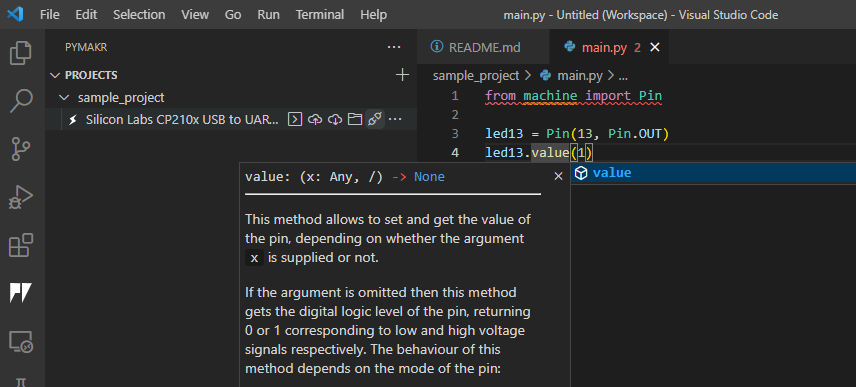

= Small integrated project with MicroPython on the ESP32
Maxime Lefrançois maxime.lefrancois@emse.fr v1.0, 2022-11-16
:homepage: http://ci.mines-stetienne.fr/cps2/course/pcd/
:toc: left

In this lab you will set up your working environment in Visual Studio Code for developing a MicroPython project for your ESP32 microcontroller, and develop a small integrated project of your choice.

== Introduction to the stub project

Directory `labs/esp32_micropython_project/sample_project` is a sample project that you can use as a starting point.

Copy it, and open your copy with VSC. the `README.md` explains the content of this directory. You should have enabled:

* Linting compatible with Micropython
* VSCode Intellisense
* Autocompletion

.Autocompleting MicroPython code

You need to check out the following guides for this exercise:

* Guide: link:https://micropy-cli.readthedocs.io/[Micropy Cli documentation]
* Tutorial: link:https://lemariva.com/blog/2019/08/micropython-vsc-ide-intellisense[MicroPython: VSCode IntelliSense, Autocompletion & Linting capabilities]

The autocompletion is not perfect, but it should help you to develop faster.

//NOTE: Windows users: do the tutorial in the powershell if you use VSC on windows. You may also do the tutorial in WSL1 (not WSL2). `pip install` may freeze. Reason link:https://github.com/microsoft/WSL/issues/6643#issuecomment-1033864007[here]. As a quick fix: install the link:https://sourceforge.net/projects/xming/[Xming X Server for windows], and run XLaunch.exe with the default configuration. A X Server allows native linux applications to open a GUI on windows, which seems to unlock the situation.

== Uploading the Code

In the `Projects` tab, you can attach a device to your project, then you can:

* Create a terminal
* Upload the project to the board
* Download the files that are on the board
* Check the content of the board in a small file explorer
* Reset, erase the device, 
* ... and other options

== Small integrated project

In the remaining time allocated by the professor, develop one or more small projects that integrate some of the different peripherals you have used in lab `lab_esp32_micropython_intro.adoc`.

Write here the location of the project in your repository, and describe the main purpose and functionnalities of your project in its `README.md` file.

Some simple ideas:

* Make the led color vary based on the potentiometer value
* Make the small monster move on the screen, and controle it using the buttons or the potentiometer
* Develop a small JSON HTTP web service to control get the temperature and humidity, to set the RGB light, to update the text on the screen

IMPORTANT: You may totally use snippets from existing samples or answers to questions on stackoverflow for example. But whenever you do **cite your sources** 

== Next steps

Next your will use a fork of MicroPython, CircuitPython, to develop on the other two microcontrollers at your disposals. Move to `lab_nrf52_circuitpython_intro.adoc`

