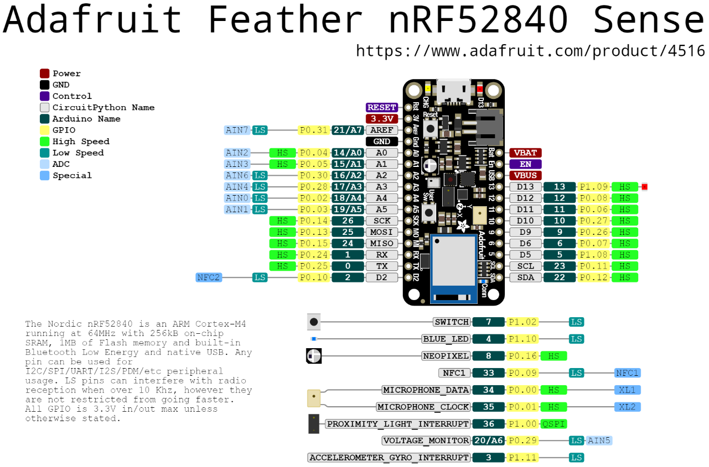

= First steps with programming the Adafruit Feather nRF52840 Sense
Maxime Lefrançois maxime.lefrancois@emse.fr v1.0, 2022-11-16
:homepage: http://ci.mines-stetienne.fr/cps2/course/pcd/
:toc: left

In this lab you will set up your working environment in Visual Studio Code for developing a CircuitPython project for your two nRF52840 microcontrollers, and develop a small integrated project of your choice.

== Introduction to the Adafruit Feather Bluefruit Sense

The nRF52 Series SoCs was the second series of short range wireless SoCs from Nordic Semiconductor. The nRF52840 SoC is very successful and exists in millions of popular consumer devices in the world today, among them wireless mice, keyboards and audio devices. The popularity of Nordic's nRF52 series allows for Nordic Semiconductor to maintain a 40% worldwide market share in the Bluetooth LE segment. (source: Wikipedia)

The briefcase contains two link:docs/adafruit-feather-sense.pdf[Adafruit Feather Bluefruit Sense], that contain the link:docs/nRF52840_PS_v1.7.pdf[nRF52840] Soc, which is well known for its Bluetooth 5 + IEEE 802.15.4-2006, 2.4 GHz transceiver.

The Adafruit Feather Bluefruit Sense also embeds a set of environmental and motion sensors:

* ST Micro series 9-DoF motion - link:docs/LSM6DS33.pdf[LSM6DS33 Accel/Gyro] + link:docs/lis3mdl.pdf[LIS3MDL magnetometer]
* link:docs/Avago-APDS-9960-datasheet.pdf[APDS9960 Proximity, Light, Color, and Gesture Sensor]
* link:docs/MP34DT01-M.pdf[MP34DT01-M] PDM Microphone sound sensor
* link:docs/Sensirion_Humidity_Sensors_SHT3x_Datasheet_digital-971521.pdf[SHT Humidity sensor]
* link:docs/BST-BMP280-DS001-11.pdf[BMP280 temperature and barometric pressure/altitude sensor]

.The Adafruit Feather Bluefruit Sense pinouts

Browse the specifications about these products.  Answer the following questions.

1. **What kind and how much of flash is available for programs?** 

 The Adafruit Feather Bluefruit Sense -- 1MB flash and 256KB SRAM
 Nordic nRF52840 Bluetooth LE processor - 1 MB of Flash
 QSPI -  2MB of internal flash storage

2. **For each sensor, state what is its digital interface to the main nRF52840 SoC.**
 
  
3. **For I2C connected devices, provide examples of data flow for obtaining measurement values.** 

  In I2C connected devices, It consists of the serial clock (SCL) and serial data (SDA) lines. Data is transferred in byte packets. 
  Each byte is followed by an acknowledge bit. Data is
  transferred with the most significant bit first. Data flow starts with START condiation from Master and it ends with STOP condiation by Slave.

4. **How is the microphone data transmitted?**

 Microphones have radio transmitters that send their audio signals via RF frequencies to compatible radio receivers.

5. **Why are the proximity light and the accelerometer/gyro connected have interrupt pins on gpio#36 and gpio#3? What can that be used for? How?**

   An interrupt is a signal to the processor released by hardware or software indicating an event that needs immediate attention. An interrupt alerts the processor
    to a high-priority condition requiring the interruption of the current code the processor is executing.

6. **What kind of process would be necessary to detect that the sound is louder than a threshold value?**

  The sound level at the threshold value is 0 dB. 

== Start working with CircuitPython on the nRF52840

Follow these steps:

1. Install the CircuitPython extension for Visual Studio Code
2. follow the steps at https://learn.adafruit.com/adafruit-feather-sense/circuitpython-on-feather-sense 
3. open the usb directory inside visual studio code
4. in the `View - Command Palette` menu, select the board using command `> CircuitPython: choose CircuitPython Board` and select `Adafruit Industries LLC: Feather Bluefruit Sense`
5. one by one, install the libraries you need using the command `> CircuitPython: Show available libraries`, then search for a library, then press enter. the libraries should be downloaded in the lib folder.

NOTE: the sources of these libraries can be found link:https://github.com/adafruit/Adafruit_CircuitPython_Bundle/tree/main/libraries/drivers[on github]. In the repository of each library, for example for the link:https://github.com/adafruit/Adafruit_CircuitPython_APDS9960[APDS9960 Proximity, Light, RGB, and Gesture Sensor], you will find the source code, the sources of the documentation, and ready-to-run examples.

NOTE: The documentation is published at `https://docs.circuitpython.org/projects/<<name_of_the_library>>/en/latest/api.html`. For example: 

* https://docs.circuitpython.org/projects/apds9960/en/latest/api.html for the APDS9960 Proximity, Light, RGB, and Gesture Sensor
* https://docs.circuitpython.org/projects/bmp280/en/latest/api.html for the BMP280 Temperature and Barometric Pressure sensor

Answer the following questions.

1. **List some of the main differences you notice in the core modules of MicroPython and CircuitPython**

   In Micro Python we can have different files running at the same time and sharing the same state, but in Circuit Python there's no sharing of States. 
2. **If one wants to backport a CircuitPython to MicroPython, what kind of modifications could be necessary?**

   CircuitPython is a derivative of MicroPython

_(edit this file and write your answers here)_

programto blink led lamp
  [source,python]
----
import board
import digitalio
import time

led = digitalio.DigitalInOut(board.LED)
led.direction = digitalio.Direction.OUTPUT

while True:
    led.value = True
    time.sleep(0.5)
    led.value = False
    time.sleep(0.5)
----

connect external led and blink
 [source,python]
----

import time
import board
from digitalio import DigitalInOut, Direction, Pull
import digitalio
        
led = DigitalInOut(board.D6)
led.direction = digitalio.Direction.OUTPUT
while True:
      led.value = True
      time.sleep(0.5)
      led.value = False
      time.sleep(0.5)
----

circuit python program to turn on led when button clicked 
 [source,python]
----
import time

import board
from digitalio import DigitalInOut, Direction, Pull
import digitalio
        
led = DigitalInOut(board.D6)
led.direction = digitalio.Direction.OUTPUT

switch = DigitalInOut(board.D9)
switch.direction = digitalio.Direction.INPUT
switch.pull = Pull.Down
while True:
    if switch.value:
      led.value = True
    else:
      led.value = False
----

circuit python program to read potentiometer value via analog input 
 [source,python]
----
import time
import board
from analogio import AnalogIn

input  = AnalogIn(board.A1)

while True:
    value =  (input.value * 3.3)
    finalValue = value/65536
    print("input voltage ", finalValue)
    time.sleep(2)
----

circuit python program to read data from dht22 - didn't work - dht22 not found error was occured
 [source,python]
----
import time
import board
import adafruit_dht

dhtDevice = adafruit_dht.DHT22(board.D9)

while True:
        temperature = dhtDevice.temperature
        humidity = dhtDevice.humidity
        print("temperature - ", temperature)
        print("humidity - ", humidity)
        time.sleep(2)
----

read inbuilt temperature value using bm280 driver

 [source,python]
----
import time
import board
import adafruit_bmp280

i2c = board.I2C()
bmp280 = adafruit_bmp280.Adafruit_BMP280_I2C(i2c)
bmp280.sea_level_pressure = 1013.25

while True:
    print("temperature - " , bmp280.temperature)
    print("pressure - ",  bmp280.pressure)
    time.sleep(1)
----

circuit python  program to display hello world in led display
[source,python]
----
import board
import displayio
import adafruit_displayio_ssd1306

i2c = busio.I2C(SCL, SDA)

displayio.release_displays()

i2c = board.I2C()
displayBus = displayio.I2CDisplay(i2c, device_address=0x3C)
display = adafruit_displayio_ssd1306.SSD1306(displayBus, width=128, height=32)

displayText = displayio.Group()
display.show(displayText)

# Draw a label
text = "Hello World!"
displayText.append(text_area)
----

Circuit python program to log data to adalogger - but didn't worked - sd card not found error was occured

 [source,python]
----

import board
import busio
import digitalio
import adafruit_sdcard
import storage

spi = busio.SPI(board.SCK, MOSI=board.MOSI, MISO=board.MISO)
cs = digitalio.DigitalInOut(board.D5)

sdcard = adafruit_sdcard.SDCard(spi, cs)
vfs = storage.VfsFat(sdcard)

storage.mount(vfs, "/sd")

with open("/sd/test.txt", "w") as f:
    f.write("Hello world")

----
sample concurrent programming in circuit python using asyncio
 [source,python]
----

import asyncio
import board
import digitalio

async def blink(pin, interval, count):
        led = digitalio.DigitalInOut(pin)
        led.direction = digitalio.Direction.OUTPUT
        for _ in range(count):
            led.value = True
            await asyncio.sleep(interval)
            led.value = False
            await asyncio.sleep(interval)

async def main():  # Don't forget the async!
    led_task = asyncio.create_task(blink(board.LED, 0.25, 10))
    led_task1 = asyncio.create_task(blink(board.D6, 0.5, 10))
    await asyncio.gather(led_task)
    await asyncio.gather(led_task1)
    print("done")

asyncio.run(main())
----

sample circuit python program for interrupts using countio
 [source,python]
----

import asyncio
import countio
import board
import digitalio

async def sendDataViaBle(pin,output,interval,count):
     interrupt = countio.Counter(pin, edge=countio.Edge.RISE)   
     while True:   
      if interrupt.count > 0:    
        led = digitalio.DigitalInOut(output)
        led.direction = digitalio.Direction.OUTPUT
        for _ in range(count):
            led.value = True
            await asyncio.sleep(interval)
            led.value = False
            await asyncio.sleep(interval)
        interrupt.count = 0 
        await asyncio.sleep(0)
async def main():
    led_task = asyncio.create_task(sendDataViaBle(board.D6, board.LED, .2,2))
    await asyncio.gather(led_task)
    print("done")

----

== Small integrated project

In the remaining time allocated by the professor, develop one or more small projects that integrate the different sensors and actuators of the Adafruit Feather Bluefruit Sense, and potentially some of the different peripherals you have used in lab `lab_esp32_micropython_intro.adoc`.

Write here the location of the project in your repository, and describe the main purpose and functionnalities of your project in its `README.md` file.

IMPORTANT: You may totally use snippets from existing samples or answers to questions on stackoverflow for example. But whenever you do **cite your sources** 

== Next steps

Next your will work a bit with BLE. Move to `lab_ble.adoc`