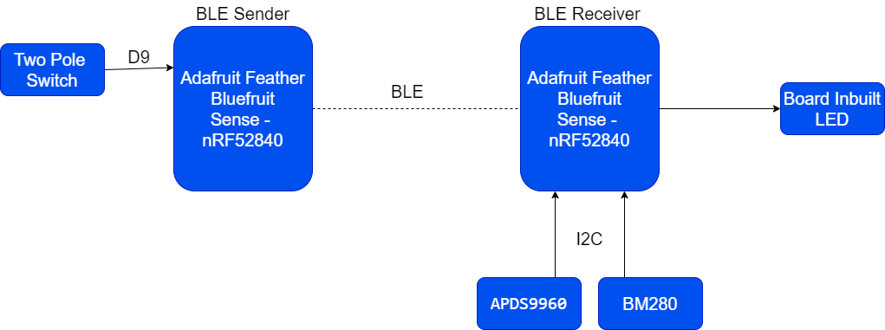

# Circuit Python mini project 

## Before downlading the code - We need to flash the controller

- Download the latest cicruit python frimware 
- Connect the controller to computer 
- Press the reset button of controller twice, it will go to boot mode
- Now to drag the frimware to drive connected 

Then download the code.

## Architecture of the project 

## Implemented features 

- [ ] A bluetooth client program was developed in one nRF52840 controller to send a digital input signal to second nRF5280 controller.

- [ ] A bluetooth server program was developed in the second nRF5280 controller to receive the input signal from the first nRF5280 and turn on/off a  LED lamp.

- [ ] In second nRF5280 controller, a task was written to read  pressure,altitude and temperature using adafruit_bmp280 driver via I2C.

- [ ] In second nRF5280 controller, another task was written to read the proximity value using adafruit_apds9960 driver via I2C.

